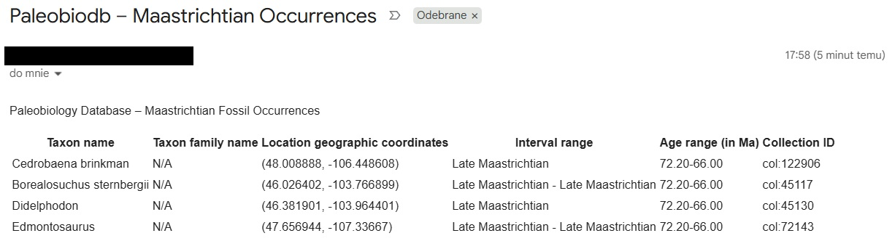

# PaleoBioDB Geo Locator

Python tool for processing paleobiological occurrence data from CSV files or the Paleobiology Database API. It exports structured data to CSV and optionally formats data into an HTML message and sends it via email.

---

## Features

* Load PBDB occurrence data from CSV or fetch it from the public PBDB API
* Normalize and map fields into structured records
* Export data to a CSV file
* Optionally send data via SMTP email
* Provide a simple manual smoke test for end-to-end validation

---

## Installation

```bash
git clone https://github.com/smsln93/paleobiodb-geo-locator.git
cd paleobiodb-geo-locator

python -m venv venv
source venv/bin/activate  # Windows: venv\Scripts\activate

pip install -r requirements.txt
```

---

## Configuration

To configure the application, copy the example configuration files and adjust them to your environment.


*Application configuration*

Copy the default configuration file:

```bash
cp app/config/config_example.toml app/config/config.toml
```

Then update it according to the provided schema inside the file.

This configuration defines the default application settings, including data source (Paleobiology Database API), query parameters, and geospatial filtering options. It also controls optional features such as email sending.


*Environment variables*

Copy the example .env file:

```bash
cp .env.example .env
```

Then fill in the values only if you plan to use email sending functionality.

For Gmail accounts, you must use an App Password instead of your normal account password.

---

## Run example

Before running the script, ensure the `.env` file is configured correctly.

Then execute:

```bash
python scripts/email_check.py
```

This will:

* load example CSV dataset stored in /data
* generate data in HTML format
* send email via SMTP

---

## Example output



The dataset may contain incomplete values, which reflects the nature of real-world data in the source database. The example CSV file is also used for testing and validation purposes.

---

## Notes

* Uses Gmail App Password for SMTP authentication
* Intended for learning, research, and hobby purposes.
* API results may vary over time
* Main application entrypoint (`main.py`) is experimental and not fully validated
* Core pipeline is currently verified via manual smoke test script
* Requires additional testing and validation

---

## Future Roadmap

* [ ] Replace static bounding box with auto-generated area based on a single coordinate
* [ ] Add map visualization of the queried area with fetched occurrences
* [ ] Implement caching for API responses
* [ ] Extend dataset with additional analytical fields
* [ ] Improve HTML formatting for email data presentation or replace it with sending a CSV file as an attachment.

